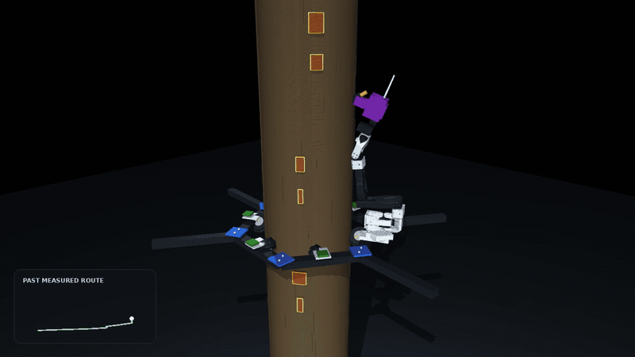
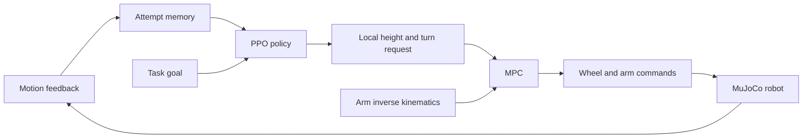

# PalmClimber: RL + MPC for Autonomous Tree Care

PalmClimber started as a palm-tree climbing robot built for a robotics competition.
The original platform used six driven wheels to grip the trunk and climb.
This project extends that hardware concept into a tree-care system: climb to a
target, recover when a wheel gets blocked, position an arm, and prune while spraying.

The control system combines **reinforcement learning (RL)** for navigation decisions
with **model predictive control (MPC)** for continuous motion. We develop and train
it in MuJoCo, using a single-layer climbing frame and a SO-101-derived arm with an
integrated scissors/nozzle tool.


[](assets/escape_demo.mp4)

[Watch the 17-second simulation demo](assets/escape_demo.mp4)

The demo follows one robot through obstacle contact, recovery, climbing, arm
extension, realignment, simultaneous pruning/spraying, and withdrawal.

## Why combine RL and MPC?

Climbing a tree involves more than tracking a height command. Contact conditions
change around the trunk, a wheel can meet a raised patch, and motor rotation does
not always produce upward motion. Extending the arm also changes the load on the
frame and can move the tool away from a target that was reachable a moment earlier.

MPC is useful for the part we can model: how wheel motion changes height and
azimuth, how the arm moves, and which actuator and posture limits should be
respected. It predicts a short motion horizon, applies the first command, and
solves again using updated feedback. But continuing to track an upward reference
does not answer the recovery question: **which direction should the robot try
next, and how far should it turn?**

RL learns that choice from experience. A small turn may clear a narrow obstruction;
a wider patch or several nearby patches may require a larger turn or a retreat.
The policy sees the outcome of previous attempts and selects a new local goal.
MPC then executes that goal within the robot's motion constraints.

This division keeps the learning problem focused on navigation and recovery while
using the robot model for wheel and arm control. The same controller can track
ordinary climbing requests and recovery requests without learning every actuator
command as part of one large policy.

## Control architecture



| Component | Responsibility |
|---|---|
| PPO policy | Choose climb, hold, retreat, and the direction and size of a turn |
| Attempt memory | Record measured progress and unsuccessful requests near the current pose |
| MPC | Track local goals with limits on base motion, wheel commands, arm motion, and passive tilt |
| Inverse kinematics | Update arm joint targets from the current base pose and tool target |
| Task stages | Sequence arrival, extension, realignment, tool operation, and withdrawal |

The actor is a feedforward network:

```text
313 observations → 256 Tanh → 256 Tanh → 21 action logits
```

A separate value network uses the same hidden-layer sizes and produces one value
estimate. The observation combines motion feedback, the task goal, recent commands,
and explicit attempt history. The memory is maintained by the environment and
supplied to the network as features.

The 21 actions combine hold/climb/retreat with turns in either direction at three
amplitudes: 0.07, 0.20, and 0.42 radians. They request local waypoints; the distance
actually traveled depends on contact dynamics and the MPC limits. After arrival,
the arm sequence runs through inverse kinematics and MPC.

## Learning to recover from blocked motion

An obstacle is first encountered through its effect on motion. The robot attempts
to climb, but height gain falls while encoder motion, slip, or a motor-load proxy
indicates that the request is not working. The policy uses that feedback to decide
whether to keep climbing, turn, hold, or move down before trying another route.

Attempt memory records what was requested and what actually happened in the nearby
height/azimuth region. This helps distinguish an untried action from one that has
already failed in a similar context. The reward penalizes repeated unsuccessful
requests and unproductive direction reversals, so spending time on the same
blocked maneuver has a cost.

Obstacles have different widths and appear at several heights. Recovery therefore
requires more than one universal turn angle. The full six-wheel footprint matters:
moving one tire clear is not enough if another tire still meets the obstruction.
MuJoCo resolves contact between the tire/roller geometries and the visible obstacle
facets. Obstacle coordinates are used to build the physical scene; the navigation
policy makes its decisions from feedback and attempt history.

## From climbing to pruning and spraying

The mission runs on one robot with one integrated tool:

1. **Climb and recover.** Reach the target height and azimuth, changing local
   navigation requests when contact prevents progress.
2. **Extend.** Bring the folded arm toward the target while monitoring the passive
   response of the climbing frame.
3. **Realign.** Recompute the tool alignment using the current base pose. Arm
   extension can tilt the frame, so the original alignment may no longer hold.
4. **Operate.** Close the scissors with the nozzle active once the alignment and
   motion gates are satisfied.
5. **Withdraw.** Retract the arm and return to a folded posture.

The base has no independent leveling actuator. Roll and pitch are passive states;
the controller accounts for them when selecting a reachable arm posture and
checking motion limits. Available base corrections are climbing and rotation
around the trunk. There is no command that simply resets the frame to level.

The navigation policy is trained. Arm positioning, task transitions, and tool
activation use model-based control and explicit task conditions. Cutting is a
simulated jaw/target event, and spraying uses a coverage model.

## Robot and simulation

| Part | Model |
|---|---|
| Climbing base | One planar frame with six driven omni wheels |
| Base motion | Vertical climbing and rotation around the trunk |
| Frame attitude | Passive roll and pitch under contact and arm loading |
| Arm | SO-101 CAD with a custom sixth positioning axis |
| Tool | Scissors and nozzle on the same end effector |
| Environment | MuJoCo trunk contact, raised obstacle facets, and leaf targets |

The photo shows the competition prototype; the video shows the simulated system.
The simulation retains the single-layer frame and six-wheel arrangement. Arm
geometry comes from SO-101 meshes, with project modifications for the extra axis
and combined tool. Asset attribution and licensing are in the
[model notice](mujoco_models/so101/NOTICE.md).

## Training

Training uses PPO with parallel Gymnasium environments. Episodes vary obstacle
placement and width, trunk friction, payload, and the starting and target poses.
A curriculum begins with simpler encounters and progresses to multiple obstacle
patches. Some episodes have no obstacles, keeping ordinary climbing in the task.

The reward favors new height progress and progress toward the task goal. It also
charges for elapsed time, repeated failed attempts, prolonged lack of progress,
unproductive reversals, excessive yaw travel, slip, and load. Arrival gives a
completion reward; an unsafe outcome gives a penalty.

The curve below shows mean validation reward during navigation pretraining from
random initialization.


The default training budget is 524,288 policy decisions across four environments.
Each environment collects 512 decisions per rollout. PPO uses eight optimization
epochs, a 0.20 clipping range, and a 0.995 discount factor.

Observation and reward normalization are enabled during training. Validation uses
fixed scenes with frozen observation statistics and raw rewards. Checkpoint
selection prioritizes successful arrivals, then measured effort, then reward.
Each saved policy is paired with its normalization statistics and metadata.

## MPC formulation

The prediction state contains base height, azimuth, passive roll/pitch, six arm
joint positions, and their velocities: 20 values in total. The optimizer chooses
two generalized base inputs and six arm velocity requests.

At each solve, the controller linearizes the motion model locally:

$$x_{k+1} = A_k x_k + B_k u_k + c_k$$

In compact form, the objective combines state tracking, tool-pose error during
realignment/operation, and input effort around the holding command:

$$\min_{u_{0:N-1}} \sum_{k=0}^{N-1}
\left(\|x_k-x_k^{ref}\|_Q^2 + \|e_k^{tool}\|_W^2
+ \|u_k-u_k^{hold}\|_R^2\right)$$

Constraints cover base speed, joint range and speed, wheel capability, and passive
tilt. Roll and pitch have no leveling objective. The default navigation setup uses
a four-step prediction horizon with a 0.12-second prediction interval. Wheel
mixing maps the base request to six shaft commands, including alternating
directions for rotation around the tree.

## Quickstart

Run these commands from the repository root using Python 3.10 or newer.

### Install dependencies

```bash
pip install -r requirements.txt
```

### Train a navigation policy

```bash
python -m rl.train_navigation \
    --output runs/train \
    --timesteps 524288 \
    --n-envs 4
```

Training writes rewards, validation results, and paired checkpoints under the
chosen output directory. `--config` accepts a JSON configuration; `--device` selects
the policy device. Outputs are excluded from version control by default.

### Evaluate the complete task

```bash
python -m scripts.evaluate_navigation \
    --policy runs/train/checkpoints/best_model.zip \
    --episodes 3 \
    --complete-task
```

Evaluation runs fresh obstacle worlds and writes results to `runs/evaluation`.
Omit `--complete-task` to evaluate navigation alone. Keep the policy's matching
`.vecnormalize.pkl` and `.json` files alongside its `.zip` checkpoint.

## Project layout

```text
assets/                      Photo, demo, and training curve
envs/
  navigation_env.py          PPO environment with native obstacle contacts
  navigation_base.py         Waypoint actions and navigation reward
  contact_env.py             Tire/roller collision scene
  tree_work_env.py           Arm, tool, and complete-task simulation
mpc/
  controller.py              Predictive base and arm control
  memory.py                  Persistent attempt outcomes
  sensor_memory.py           Motion-feedback history
rl/
  train_navigation.py        PPO training and checkpoint selection
  policy.py                  Policy loading and normalization
scripts/
  evaluate_navigation.py     Navigation and full-task evaluation
mujoco_models/               Robot model, SO-101 meshes, and license
```

## Hardware transfer

The next step is to connect the simulated controller to the competition platform's
sensor and motor interfaces. That requires calibrating wheel motion and traction,
measuring height and azimuth reliably, and validating the arm-load model against
the physical frame. The current learning curve and mission demo are simulation
results; hardware evaluation remains a separate part of the project.
