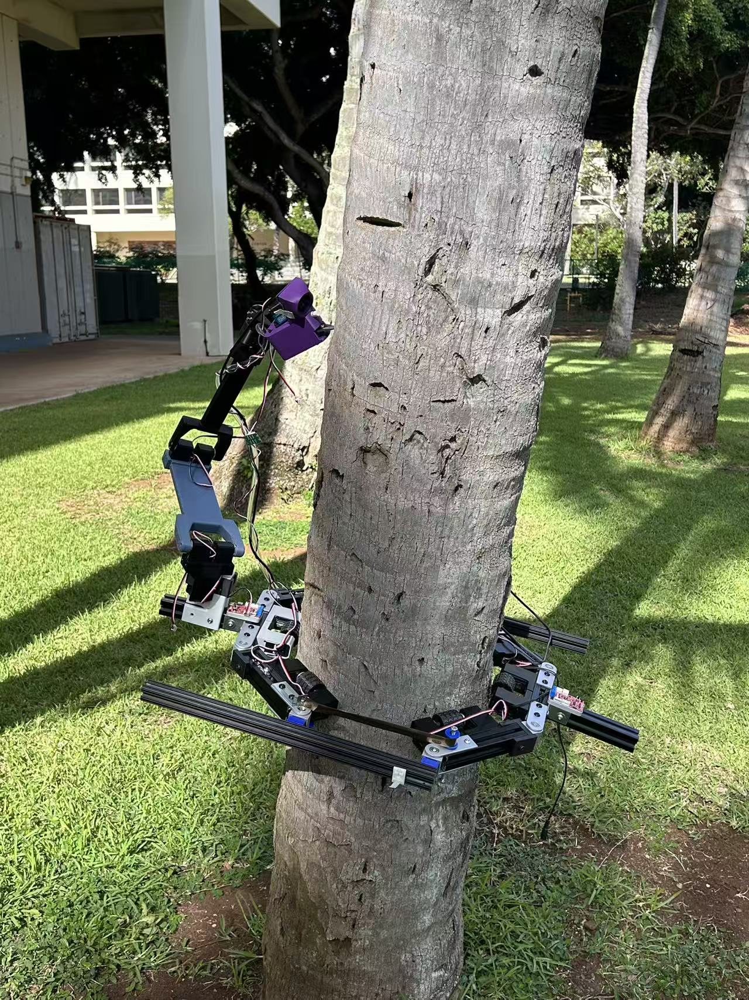
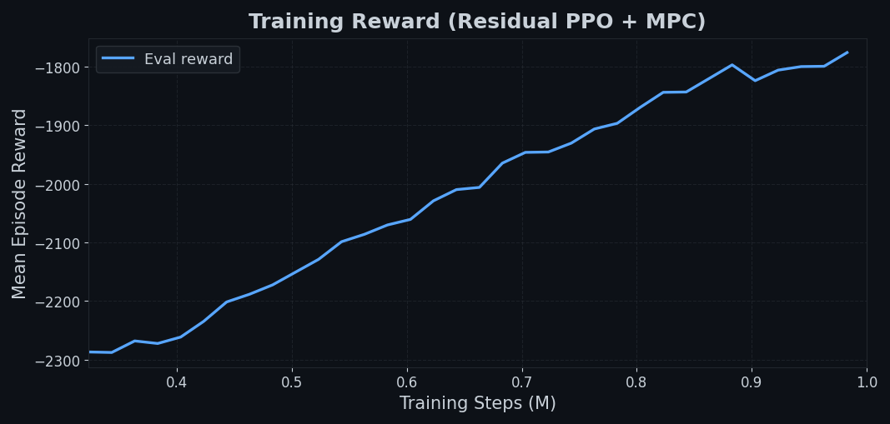
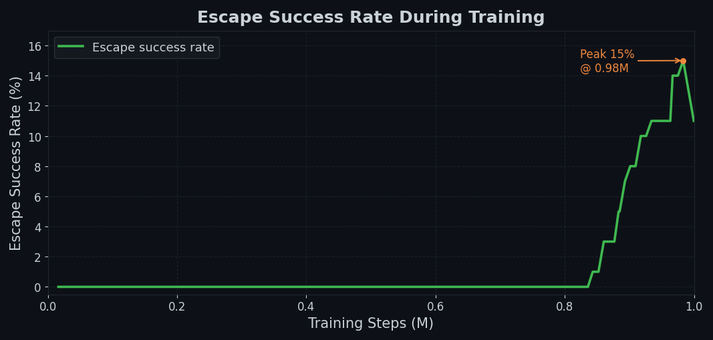

# PalmBot-MPCRL: Residual RL + MPC for a Tree-Climbing Loco-Manipulation Robot

This is a research project to make a palm tree climbing robot smarter. The hardware was originally built for a robotics competition and uses 6 Dynamixel motors to crawl up tree trunks. We added a SO-ARM101 robot arm on top so it can eventually harvest coconuts or do pruning tasks.

The main idea is combining **Model Predictive Control (MPC)** for stability with **Reinforcement Learning** for adapting to real-world uncertainty (wet bark, different tree diameters, etc.). Training is done in MuJoCo.



---

## Demo — Escape from Low-Friction Patch

The robot detects a stall, smoothly hands authority from MPC to the RL residual, rotates out of the groove, and resumes climbing. This behavior is never hardcoded — it emerges from reward shaping.


---

## Why MPC + RL?

Pure MPC works fine if you know the exact friction coefficient of the tree. You don't. Wet bark in Hawaii feels nothing like dry bark, and the model just breaks.

Pure RL is fine too but takes forever to converge for a safety-critical task like this (you don't want the robot sliding down 3 meters mid-episode).

The residual RL idea (from [1]) is clean:

```
u_final = u_MPC + ΔuRL
```

MPC handles the nominal case and keeps the robot stable. RL only needs to learn a small correction term. In practice this converges 3-4x faster than pure RL and the policy is much more interpretable.

---

## Emergent Behaviors

**1. Stuck recovery**

Real palm trees have bark grooves every ~20-30cm. When a wheel drops into one the robot stalls — motors spin but height doesn't change. We don't write an explicit "if stuck → turn" rule. Instead:

- The 29D actor observation includes `stuck_counter`, `height_gain_rate`, current normalized `u_mpc`, stuck-gated authority terms, azimuth sin/cos, azimuth rate, and the previous magic lateral command
- When progress stalls under upward MPC commands, `stuck_level` ramps smoothly over ~0.4s: MPC authority drops and RL residual authority increases so the policy can command descent/oscillation/escape motions
- After rotation, it returns to uniform upward speed

In simulation, stuck regions are local height/azimuth patches, not full-ring bands. Each wheel checks its MuJoCo world position against these patches, so only the wheels touching that local patch lose traction.

**2. Target-aware rotation**

There's a leaf/pruning target placed at a random azimuth (0-360°) and height (1.6-2.4m). The observation includes `azimuth_error`, and the reward penalises misalignment when the robot is near the target height. The agent learns to simultaneously climb and yaw, arriving at the right height already oriented correctly.

---

## System Overview

```
┌─────────────────────────────────────────────────────┐
│              Task Planner (user / high-level RL)    │
│         target_height, arm_target_pose              │
└──────────────┬──────────────────────────────────────┘
               │
   ┌───────────┴────────────┐
   │                        │
┌──▼──────────────┐  ┌──────▼──────────┐
│  Climbing MPC   │  │  Arm Policy     │
│  (casadi/ipopt) │  │  SAC, SB3       │
│                 │  │                 │
│  state: h,v,θ   │  │  SO-ARM101 6DOF │
│  output: u_mpc  │  │  → ee to target │
└──────┬──────────┘  └────────────────┘
       │
┌──────▼──────────┐
│  Residual PPO   │
│  ΔuRL ← f(obs)  │
└──────┬──────────┘
       │
┌──────▼──────────────────────┐
│   MuJoCo Sim / Real Robot   │
│   6x Dynamixel + MPU-6050   │
│   Arduino + Serial (50Hz)   │
└─────────────────────────────┘
```

---

## Results (simulation, 1M training steps)

Training uses 4 parallel MuJoCo environments. Local low-friction patches are randomized each episode by height, azimuth, angular width, and severity. Leaf target azimuth and height are also randomized.

**Reward curve** — policy improves steadily as it learns to stay upright and climb efficiently:



**Escape success rate** — escape behavior emerges around 850k steps and peaks at ~15% near 975k steps:



---

## Pretrained Checkpoint

The `checkpoints/` folder contains the policy saved near the escape-success peak (~1M steps):

| File | Description |
|------|-------------|
| `checkpoints/ppo_1M.zip` | PPO policy weights |
| `checkpoints/vec_normalize_1M.pkl` | VecNormalize observation statistics |

Load and run in simulation:

```python
from stable_baselines3 import PPO
from stable_baselines3.common.vec_env import DummyVecEnv, VecNormalize
from envs.tree_climber_env import TreeClimberEnv

env = DummyVecEnv([lambda: TreeClimberEnv()])
env = VecNormalize.load("checkpoints/vec_normalize_1M.pkl", env)
env.training = False
env.norm_reward = False

model = PPO.load("checkpoints/ppo_1M.zip", env=env)

obs = env.reset()
for _ in range(1000):
    action, _ = model.predict(obs, deterministic=True)
    obs, _, done, _ = env.step(action)
    if done:
        obs = env.reset()
```

---

## Hardware

- **Climbing body**: 6x Dynamixel MX-28, ring circumference ~1.2m, 2 clamping rings
- **Arm**: SO-ARM101 (5 DOF + gripper), STS3215 servos, mounted on top of the frame
- **IMU**: MPU-6050 on the Arduino (pitch/roll at 50Hz)
- **Controller**: Arduino Mega + DynamixelShield
- **PC**: any laptop running Python, connected via USB-Serial

The MuJoCo model approximates the real geometry as faithfully as we could without CAD files. Tree trunk radius = 0.12m, robot ring outer radius ~0.19m.

---

## Quickstart

```bash
git clone https://github.com/zsiyuan-eng/PalmClimber-RL.git
cd PalmClimber-RL
pip install -r requirements.txt
```

### View the MuJoCo model

```bash
python -m mujoco.viewer mujoco_models/scene.xml
```

### Train climbing policy

```bash
python rl/train_climber.py --n-envs 4
```

Add `--no-mpc` to train a pure RL baseline for comparison. Default: 1M timesteps.

### Evaluate escape policy

```bash
python scripts/evaluate_escape_policy.py --model checkpoints/ppo_1M.zip \
    --vec-normalize checkpoints/vec_normalize_1M.pkl --n-episodes 100
```

### Record a demo video

```bash
python scripts/record_escape_demo_video.py --model checkpoints/ppo_1M.zip \
    --vec-normalize checkpoints/vec_normalize_1M.pkl
```

### Deploy on real robot

Flash `deploy/firmware_mpcrl.ino` to the Arduino, then:

```bash
python deploy/run_policy.py --port COM12 --target-height 2.0
```

For manual keyboard control:
```bash
python deploy/teleop.py
```

---

## Repo Structure

```
PalmClimber-RL/
├── assets/
│   ├── robot_photo.jpg
│   ├── escape_demo.mp4       ← demo video
│   ├── reward_curve.png      ← training reward (1M steps)
│   └── success_rate.png      ← escape success rate (1M steps)
├── checkpoints/
│   ├── ppo_1M.zip            ← pretrained policy (~1M steps)
│   └── vec_normalize_1M.pkl  ← observation normalization stats
├── mujoco_models/
│   ├── scene.xml             ← training scene (tree + base-only visual robot)
│   ├── tree_climber.xml      ← robot body only
│   └── so_arm101/            ← SO-ARM101 MJCF (simplified)
├── envs/
│   ├── tree_climber_env.py   ← Gymnasium env, MPC-RL interface
│   └── arm_env.py            ← arm reach env (legacy)
├── mpc/
│   └── climbing_mpc.py       ← CasADi MPC, 6-state model, 20-step horizon
├── rl/
│   ├── train_climber.py      ← PPO residual training
│   ├── train_arm.py          ← SAC arm training (legacy)
│   ├── train_escape_expert.py← expert BC + fine-tuning for escape behavior
│   ├── collect_escape_expert.py
│   └── residual_agent.py     ← custom feature extractor with LayerNorm
├── deploy/
│   ├── run_policy.py         ← load model + serial loop (50Hz)
│   ├── firmware_mpcrl.ino    ← Arduino firmware (numeric velocity cmds)
│   ├── firmware_wasd.ino     ← original WASD teleop firmware
│   └── teleop.py             ← keyboard teleoperation
└── scripts/
    ├── evaluate_escape_policy.py
    └── record_escape_demo_video.py
```

---

## MPC Formulation

The nominal climbing model:

$$\mathbf{x} = [h,\ \dot{h},\ \theta_x,\ \dot\theta_x,\ \theta_y,\ \dot\theta_y]^\top$$

Slip/traction approximation:

$$v_i = r_w u_i,\quad s_i = v_i - \dot{h}$$

$$F_i = F_{max}\tanh(K_{slip}s_i/F_{max}),\quad F_{max}=\mu N_i$$

$$\ddot{h} = \frac{\sum_i F_i - mg - b\dot{h}}{m}$$

where $\mu=0.70$ is nominal friction, $r_w=0.025$m. The MPC solves a 20-step horizon NLP at each step:

$$\min_{\mathbf{u}_{0:N-1}} \sum_{k=0}^{N-1} \|\mathbf{x}_k - \mathbf{x}_{ref}\|_Q^2 + \|\mathbf{u}_k\|_R^2$$

with wheel speed limits $|u_i| \leq 22$ rad/s. The RL residual is combined through a stuck-gated authority mechanism:

$$\mathbf{u}_{final} = w_{mpc}\mathbf{u}_{mpc} + s_{rl}\pi_\theta(\mathbf{x}, \mathbf{u}_{mpc})$$

When progress stalls, $w_{mpc}$ smoothly decreases toward 0.2 and $s_{rl}$ increases from 4 to 20, giving the policy enough authority for recovery. Normal climbing remains MPC-dominant.

---

## Notes / Known Issues

- The MJCF wheel-tree contact is finicky. If the robot falls immediately on reset, try bumping the `solimp` values in `scene.xml` or increasing `friction` on the trunk geoms.
- CasADi IPOPT sometimes hits iteration limits on the first few steps of an episode. The env catches solver failures and falls back to a P controller.
- The height estimator in the Arduino firmware integrates wheel speed only. A proper estimate needs encoder feedback + IMU fusion.
- SO-ARM101 in the model is a geometric approximation. The real STS3215 servos have different torque curves; gains will need tuning for real deployment.

---

## References

[1] Johannink et al., "Residual Reinforcement Learning for Robot Control", ICRA 2019.

[2] Rawlings et al., "Model Predictive Control: Theory, Computation, and Design", 2017.

[3] TheRobotStudio, SO-ARM100: https://github.com/TheRobotStudio/SO-ARM100

[4] Todorov et al., "MuJoCo: A physics engine for model-based control", IROS 2012.

---

## TODO

- [ ] sim-to-real: measure real friction on actual palm trees
- [ ] height sensing: add ToF sensor or encoder odometry on real hardware
- [ ] arm training: train SO-ARM101 reach policy and re-integrate into the main scene
- [ ] full loco-manipulation pipeline: combine climbing policy + arm policy into a single end-to-end task (climb → align → reach)

PRs welcome.
